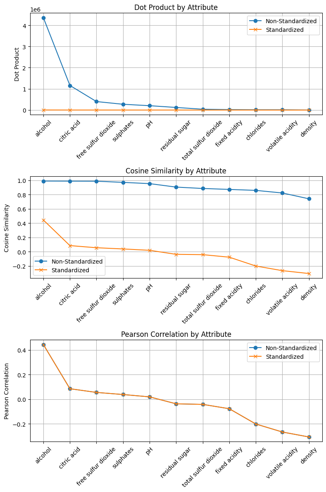
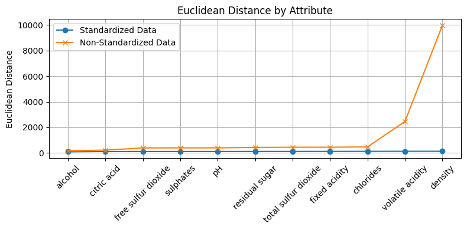
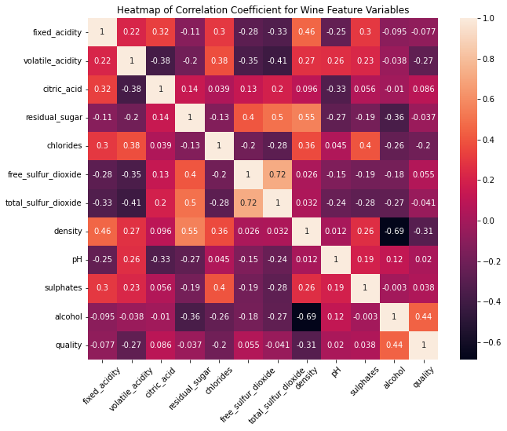
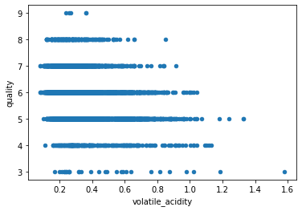
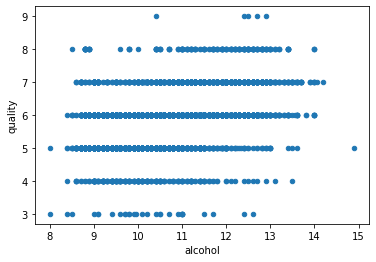
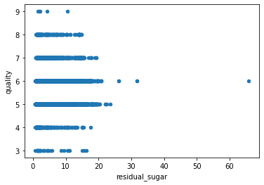
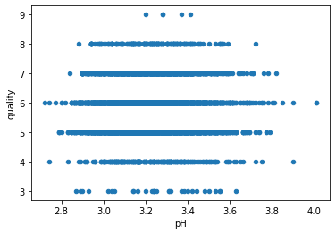

# Wine Tasting Analysis

This repository contains an in-depth analysis of wine quality using various proximity measures on the `wine-quality-white-and-red.csv` dataset. The project evaluates different similarity measures to identify significant predictors of wine quality.

## Project Overview

### Proximity Measures Implemented

- **Euclidean Distance**
- **Dot Product**
- **Cosine Similarity**
- **Pearson Correlation**

### Key Features

1. **Data Preprocessing**: Standardizes the dataset to ensure fair comparison across different measures.
2. **Similarity Calculations**: Computes similarity scores between predictors and the target variable (`quality`) using various measures.
3. **Ranking Predictors**: Ranks predictors based on their similarity scores to the target variable.
4. **Visualizations**: Provides visualizations to help interpret the similarity measures and their effectiveness.

### Dataset

The dataset used is `wine-quality-white-and-red.csv`, containing wine quality data.

### Analysis

- **Association of Predictors with Quality**: Evaluates the similarity of each predictor to the `quality` column using different measures.
- **Effect of Standardization**: Compares the effect of standardizing the dataset on the similarity scores and ranking of predictors.
- **Comparison of Different Measures**: Discusses the strengths and weaknesses of each measure in identifying significant predictors.

## Visualizations

### Dot Product by Attribute


### Cosine Similarity by Attribute


### Pearson Correlation by Attribute


### Euclidean Distance by Attribute


### Heatmap of Correlation Coefficient for Wine Feature Variables


### Scatterplots of Quality vs Various Attributes





## Getting Started

### Prerequisites

- Python 3.x
- Required libraries: pandas, numpy, scipy, scikit-learn, matplotlib

1. **Clone the repository**:

   ```bash
   git clone https://github.com/Pauravinagarkar/Wine-Analysis.git
   cd Wine-Analysis

2. **Install the dependencies:**:

   ```bash
    pip install -r requirements.txt
    jupyter notebook Pauravi_nagarkar_PR1.ipynb


### Steps to Follow: 
- **Data Preprocessing:** Load and preprocess the dataset to remove non-numeric columns and standardize the data.
- **Compute Similarities:** Use the provided functions to compute similarity measures for each predictor.
- **Rank Predictors:** Rank the predictors based on their similarity scores using different measures.
- **Visualize Results:** Generate visualizations to interpret the similarity scores and rankings.


### Conclusion:
The analysis reveals that standardization significantly affects the ranking of predictors. Alcohol consistently ranks as a top predictor across different measures, highlighting its importance in determining wine quality.

### Contributing: 
   Contributions are welcome! Please fork the repository and submit a pull request with your improvements.


### Contact- 
 ```bash
   - Pauravi Nagarkar
   - Email: pnagarkar@scu.edu
   - LinkedIn: https://www.linkedin.com/in/pauravi-nagarkar/
   - GitHub: https://github.com/Pauravinagarkar
   - Website: https://pauravi-nagarkar.netlify.app/
